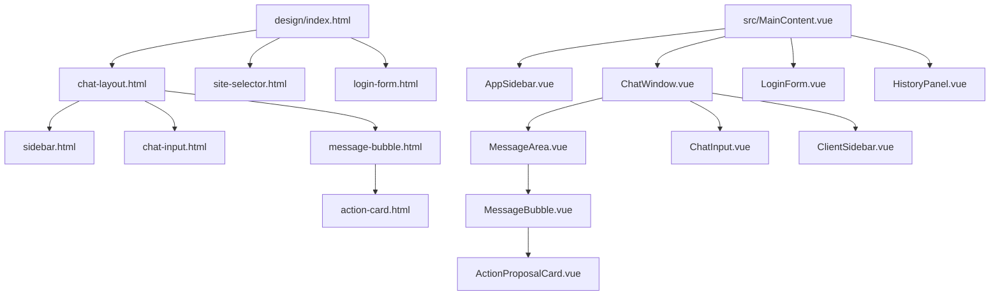
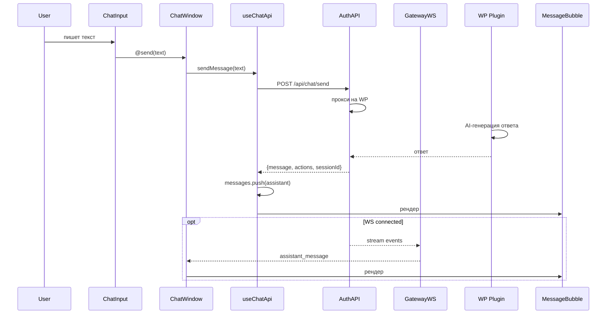
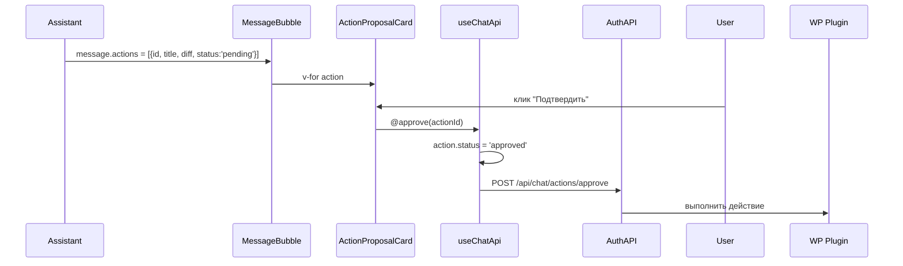
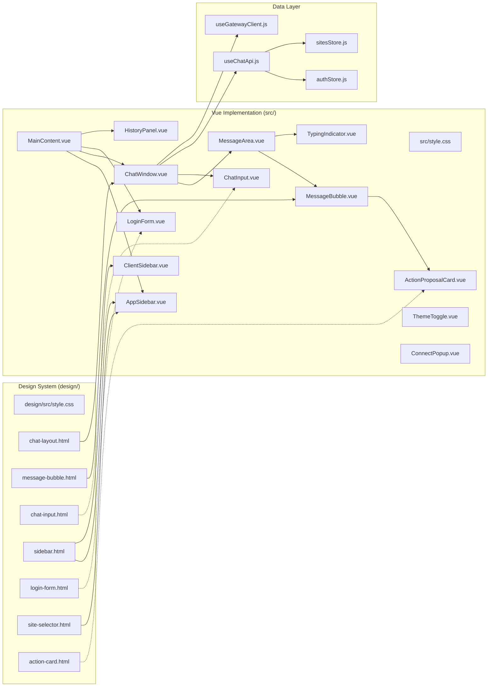

# 🎯 AI Pilot Web Chat — Аудит взаимодействия дизайна и реализации

> **Дата:** 2026-06-17  
> **Проект:** [ai-pilot-web-chat](https://github.com/EVGexpert/ai-pilot-web-chat)  
> **Дизайн-система:** `design/` (Vite + Tailwind v4, HTML-прототипы)  
> **Реализация:** `src/` (Vue 3 + Pinia + Vite + Tailwind v4)  

---

## 1. Архитектура дизайн-системы

### 1.1 Состав дизайн-системы (`design/`)

| Файл | Назначение |
|------|-----------|
| `design/package.json` | Vite + Tailwind v4 + @tailwindcss/vite |
| `design/vite.config.js` | Конфиг Vite с Tailwind плагином |
| `design/src/style.css` | **Дизайн-токены** (тёмная тема: `--color-chat-*` в `@theme`) |
| `design/index.html` | Главная страница-навигатор по компонентам |
| `design/src/components/chat-layout.html` | **Полный layout**: sidebar + хедер + сообщения + input |
| `design/src/components/message-bubble.html` | Все состояния сообщений (user, assistant, system, typing, action card, код) |
| `design/src/components/chat-input.html` | Поле ввода: пустое, с текстом, disabled, мультилайн |
| `design/src/components/sidebar.html` | Боковая панель: лого, поиск, сайты, история, профиль |
| `design/src/components/login-form.html` | Форма входа: обычная, ошибка, загрузка |
| `design/src/components/site-selector.html` | Список сайтов + выпадающий селект + подключение нового |
| `design/src/components/action-card.html` | Карточка действия: pending → approved → rejected |

### 1.2 Технологии дизайн-системы

- **Vite 6** — сборка, HMR
- **Tailwind CSS v4** — утилитарные классы + `@theme` директива
- **Чистый HTML** — компоненты без фреймворка
- **Inter** — шрифт
- **Кастомные анимации** — `fadeIn`, `slideInRight`, `pulse-dot`

---

## 2. Сопоставление: дизайн → реализация

### 2.1 Общая карта компонентов



### 2.2 Покомпонентное сравнение

| Компонент (дизайн) | Компонент (Vue) | Статус | Расхождения |
|--------------------|-----------------|--------|-------------|
| `chat-layout.html` | `ChatWindow.vue` + `MainContent.vue` | ✅ **Есть** | Layout разделён на 2 компонента (admin/client). Есть дополнительный `ClientSidebar` и `HistoryPanel`. |
| `sidebar.html` | `AppSidebar.vue` | ✅ **Есть** | Много общего, но есть расхождения (см. ниже). |
| `sidebar.html` | `ClientSidebar.vue` | ✅ **Есть** | Отдельный компонент для клиентского режима. |
| `message-bubble.html` | `MessageBubble.vue` | ✅ **Есть** | Основная структура совпадает. |
| `chat-input.html` | `ChatInput.vue` | ⚠️ **Отличается** | Дизайн — простой textarea + кнопка-стрелка. Реализация — attach + textarea + emoji + voice + Send. |
| `login-form.html` | `LoginForm.vue` | ⚠️ **Отличается** | Дизайн — email + пароль. Реализация — имя + email + пароль. |
| `action-card.html` | `ActionProposalCard.vue` | ⚠️ **Отличается стилистически** | Логика та же, но стилизация под CSS-переменные, а не Tailwind. |
| `site-selector.html` | Встроен в `AppSidebar.vue` | ✅ **Есть** | Search + список сайтов с цветными индикаторами. |
| — | `TypingIndicator.vue` | ✅ **Есть** | Отдельный компонент с pulsating dots. |
| — | `MessageArea.vue` | ✅ **Есть** | Обёртка для сообщений с no-site/connecting/start-screen состояниями. |
| — | `HistoryPanel.vue` | ✅ **Есть** | Панель истории клиентов (нет в дизайне). |

---

## 3. Детальный разбор: что откуда приходит

### 3.1 Данные и потоки

```
[WP Site] → WP REST API (/agent/*)
   ↓
[Auth API] → прокси-запросы, кэширование
   ↓
[Vue Frontend] → ChatWindow.vue → MessageArea → MessageBubble
   ↓
[Gateway WS] → streaming (опционально)
```

**Каналы API:**
1. **REST (основной):** `POST /api/chat/send` → Auth API → WP REST API → ответ
2. **WebSocket (стриминг):** `wss://chat.pilotsite.ru/ws/` → Gateway → `assistant_message` события
3. **Auth API:** `/api/auth/login`, `/api/sites/*`, `/api/chat/sessions`, `/api/chat/history`
4. **WP Plugin REST:** `/agent/context`, `/agent/action`, `/agent/memory`, `/agent/soul`

### 3.2 Жизненный цикл сообщения



### 3.3 Жизненный цикл action proposal



---

## 4. Ключевые расхождения дизайна и реализации

### 4.1 Тема — полный редизайн цветовой схемы

| Параметр | Дизайн (`design/src/style.css`) | Реализация (`src/style.css`) | Статус |
|----------|-------------------------------|------------------------------|--------|
| Палитра | Тёмная тема (slate-950: `#0f172a`) | **Светлая** + тёмная тема `[data-theme="dark"]` | 🔴 **Переписана** |
| `--color-chat-accent` | `#3b82f6` (blue-500) | `#7e4ce0` (фиолетовый) | 🔴 **Другой акцентный цвет** |
| `--color-chat-bg` | `#0f172a` (slate-950) | `#eae9ec` (светло-серый) | 🔴 **Инвертирован** |
| `--color-chat-user` | `#3b82f6` (blue) | `#7e4ce0` (purple) | 🔴 **Другой цвет** |
| `--color-chat-assistant` | `#1e293b` (slate-800) | `#ffffff` (white, light) / `#222` (dark) | 🔴 **Инвертирован** |

**Вывод:** Дизайн-система была спроектирована полностью в **тёмной теме** (slate palette). Реализация пошла по пути **светлая + тёмная тема** с фиолетовым акцентом. Это привело к тому, что **дизайн-система не синхронизирована с реализацией**.

### 4.2 Стилизация — Tailwind vs CSS-переменные

| Аспект | Дизайн | Реализация |
|--------|--------|-----------|
| Токены | Tailwind `@theme` + `--color-chat-*` | CSS-переменные `:root` + `[data-theme="dark"]` |
| Стилизация компонентов | Tailwind-классы (`bg-slate-800`, `rounded-2xl`) | CSS-переменные (`var(--chat-assistant-bg)`, `var(--border-radius-md)`) |
| Скругления | `rounded-2xl` (16px), `rounded-bl-md` | `var(--border-radius-md)` = 12px, `16px` hardcoded в некоторых местах |

**Вывод:** Дизайн использует Tailwind-классы напрямую. Реализация перешла на CSS-переменные (более гибкий подход для смены темы). Расхождения в значениях — нормально, но нужно синхронизировать.

### 4.3 ChatInput — кардинальное различие

**Дизайн** (`chat-input.html`):
- Простой textarea с обёрткой
- Кнопка-стрелка отправки (disabled/enabled)
- 3 состояния: пустой, с текстом, disabled во время загрузки
- Кнопка disabled → cursor-not-allowed

**Реализация** (`ChatInput.vue`):
- **Attach** (скрепка) + textarea + **emoji** + **voice** + кнопка **Send** с текстом
- Авто-resize textarea (max-height: 144px)
- Enter = send, Shift+Enter = новая строка
- Разные иконки, другая компоновка
- **Отличие:** дизайн сделан как минималистичный `flex items-end gap-2`, реализация — детальная форма с composable-слоем

**Вывод:** Реализация функционально богаче дизайна. Нужно либо обновить дизайн, либо убрать лишние кнопки из реализации.

### 4.4 LoginForm — поле "Имя" отсутствует в дизайне

**Дизайн** (`login-form.html`):
- Только email + пароль
- 3 состояния: обычная, ошибка, загрузка
- Иконка щита (shield-icon)

**Реализация** (`LoginForm.vue`):
- **Имя** + email + пароль (3 поля)
- Логотип изображением, а не иконкой
- Текст-подсказка про плагин внизу
- `@login` эмит для прокидывания события наверх

**Вывод:** Поле "Имя" добавлено в реализацию, но не отражено в дизайне. Нужно синхронизировать.

### 4.5 ActionProposalCard — стилизация расходится

**Дизайн** (`action-card.html`):
- Tailwind-классы: `bg-slate-900 border border-amber-500/30 rounded-2xl p-4`
- Горизонтальные кнопки "Подтвердить" / "Отклонить"
- Diff в `font-mono` блоке

**Реализация** (`ActionProposalCard.vue`):
- CSS-переменные: `var(--color-warning)`, `var(--bg-card)`
- **Различие:** иконки внутри кнопок (галочка/крестик)
- Текст кнопок: в дизайне "✓ Подтвердить" / "✕ Отклонить", в реализации "Подтвердить" / **"Отменить"** (а не "Отклонить")
- Diff-формат: дизайн показывает option + new value в простом списке, реализация показывает построчный diff с `+`/`-` маркерами

**Вывод:** Логика совпадает, но стилизация и текст кнопок отличаются. "Отменить" → должно быть "Отклонить" по дизайну.

### 4.6 Sidebar — отличается компоновка

**Дизайн** (`sidebar.html`):
- **Лого:** иконка AP в `div` (синий квадрат с буквами)
- **Поиск:** инпут с иконкой лупы
- **Разделы:** "Мои сайты" → "Недавние диалоги"
- **Профиль:** аватар Admin/admin@demo.ru + кнопка выхода

**Реализация** (`AppSidebar.vue`):
- **Лого:** изображение `logo-aipilot-v3.png`
- **Поиск:** есть
- **Кнопка "Новый чат"** — нет в дизайне
- **Навигация:** "Мой чат" + "История клиентов" (нет в дизайне)
- **Сворачивание** сайдбара (коллапс) — нет в дизайне
- **Профиль:** изображение + имя + email + шестерёнка настроек + логаут
- **ThemeToggle** — нет в дизайне
- **Группировка диалогов:** "Сегодня" / "7 дней" / "30 дней" — нет в дизайне

### 4.7 MessageBubble — тонкие отличия

| Аспект | Дизайн | Реализация |
|--------|--------|-----------|
| Avatar | Есть у ассистента и пользователя | Есть (изображения) |
| Action buttons (copy, listen и т.д.) | Нет | **Есть** (4 кнопки: listen, copy, regenerate, dislike) |
| Markdown | Нет (plain text) | **Есть** (через `marked` + `DOMPurify`) |
| Time | Есть (внутри бабла) | Есть |
| Assistent bubble color | `bg-slate-800` (dark) / `bg-slate-800/80` | `var(--chat-assistant-bg)` (белый на светлой) |

### 4.8 Компоненты без дизайна

Следующие компоненты **есть в реализации, но отсутствуют в дизайн-системе**:

| Компонент | Назначение |
|-----------|-----------|
| `TypingIndicator.vue` | Анимация печатания (3 точки) |
| `MessageArea.vue` | Область сообщений с состояниями (connecting, no-site, start, messages) |
| `MainContent.vue` | Основной лэйаут: login / admin / client, mobile-навигация |
| `HistoryPanel.vue` | Панель истории обращений клиентов |
| `ClientSidebar.vue` | Сайдбар для клиентского режима (отдельный) |
| `ThemeToggle.vue` | Переключатель темы (светлая/тёмная) |
| `ConnectPopup.vue` | Popup подключения нового сайта через WordPress |
| `HistoryPanel.vue` | Просмотр истории диалогов клиентов |

---

## 5. Данные: источники и структура

### 5.1 Структура данных, используемая в компонентах

**Message** (через `useChatApi`):
```typescript
interface Message {
  id: string
  role: 'user' | 'assistant' | 'system'
  content: string
  time?: string
  date?: string
  actions?: ActionProposal[]
}
```

**ActionProposal** (через Auth API → WP):
```typescript
interface ActionProposal {
  id: string
  title: string
  description?: string
  status: 'pending' | 'approved' | 'rejected' | 'completed'
  diff?: string[]  // строки diff с +/- маркерами
  type?: string
  target?: object
  patch?: object
  raw?: object
}
```

**Site** (через `/api/sites`):
```typescript
interface Site {
  id: string
  name: string
  url: string
  status: 'online' | 'offline' | 'pending'
}
```

**Session** (через `/api/chat/sessions`):
```typescript
interface Session {
  id: string
  title?: string
  createdAt?: string
  updatedAt?: string
  date?: string
}
```

### 5.2 Откуда приходят данные

| Данные | Источник | Маршрут | Как кэшируется |
|--------|----------|---------|----------------|
| Сообщения | WP Plugin (AI-генерация) | `POST /api/chat/send` → Auth API → WP | В WP memory |
| Сессии | Auth API | `GET /api/chat/sessions` | В памяти Auth API (SQLite) |
| История сессии | Auth API | `GET /api/chat/history` | В памяти Auth API (SQLite) |
| Action proposals | AI → WP | В ответе `/api/chat/send` | В WP + в памяти Auth API |
| Список сайтов | Auth API | `GET /api/sites` | SQLite |
| Memory сайта | WP Plugin | `GET /api/sites/:id/memory` (прокси) | TTL-кэш в Auth API |
| WS-стриминг | Gateway | `wss://chat.pilotsite.ru/ws/` | Нет (идут напрямую браузеру) |

---

## 6. Проблемы и рекомендации

### 🔴 6.1 Критические (P0)

1. **Дизайн-система не синхронизирована с реализацией**
   - Тёмная тема в дизайне vs светлая + тёмная в реализации
   - Разные акцентные цвета (blue vs purple)
   - Реализация использует CSS-переменные (`var(--chat-*)`), дизайн — Tailwind-классы
   - **Рекомендация:** обновить дизайн на актуальную цветовую схему, или наоборот — привести реализацию к дизайну

2. **ChatInput кардинально отличается**
   - В дизайне: textarea + кнопка-стрелка
   - В реализации: attach + textarea + emoji + voice + Send
   - **Рекомендация:** либо добавить кнопки в дизайн, либо убрать из реализации

### 🟡 6.2 Средние (P1)

3. **Текст кнопки ActionProposalCard**
   - В дизайне: "Отклонить"
   - В реализации: "Отменить"
   - **Рекомендация:** исправить на "Отклонить"

4. **LoginForm — поле "Имя"**
   - Есть в реализации, нет в дизайне
   - **Рекомендация:** добавить в дизайн

5. **Множество компонентов без дизайн-прототипов**
   - TypingIndicator, MessageArea, MainContent, HistoryPanel, ClientSidebar, ThemeToggle, ConnectPopup
   - **Рекомендация:** добавить их в дизайн-систему для консистентности

### 🟢 6.3 Низкие (P2)

6. **История клиентов (HistoryPanel)**
   - Не показана в chat-layout.html
   - **Рекомендация:** добавить макет с раскрытым диалогом и списком

7. **WS-стриминг**
   - Только в реализации, нет в дизайне
   - **Рекомендация:** добавить индикацию streaming в дизайн (если используется)

8. **ActionProposalCard — diff vs option/value**
   - В дизайне: option + value
   - В реализации: diff с +/- строками
   - **Рекомендация:** согласовать формат

---

## 7. Как это должно работать (спецификация)

### 7.1 Сценарий: админ управляет сайтом

```
1. Пользователь открывает chat.pilotsite.ru
2. LoginForm → вводит email + пароль
3. AuthStore.login() → JWT token в localStorage
4. SitesStore.fetchSites() → загрузка сайтов
5. MainContent рендерит:
   - AppSidebar (сайты, история)
   - ChatWindow (admin mode)
6. Пользователь выбирает сайт в Sidebar
7. ChatWindow показывает MessageArea → сообщения пусты, StartScreen
8. Пользователь пишет в ChatInput → handleSend → useChatApi.sendMessage
9. POST /api/chat/send → Auth API → WP → AI Pilot генерирует ответ
10. Ответ показывается как MessageBubble (assistant)
11. Если AI предлагает действие → ActionProposalCard (pending)
12. Пользователь кликает "Подтвердить" → useChatApi.approveAction()
13. POST /api/chat/actions/approve → Auth API → WP выполняет
14. ActionProposalCard → status = 'approved'
```

### 7.2 Сценарий: клиент на WordPress-сайте

```
1. Клиент на сайте → плагин показывает виджет чата
2. ConnectPopup → регистрация/логин → JWT
3. ClientSidebar + ChatWindow (client mode)
4. Сообщение → POST /api/chat/send с siteUrl клиента
5. Ответ → MessageBubble
6. (Опционально) WS-стриминг для real-time ответов
```

### 7.3 Роль дизайн-системы

Дизайн-система `design/` должна быть **источником истины** для визуального стиля. Процесс:

```
Дизайн (HTML + Tailwind) → Согласование → Перенос в Vue → style.css токены
```

На данный момент этот процесс **нарушен** — дизайн устарел относительно реализации.

---

## 8. Итоговая карта зависимостей



---

## 9. Выводы

1. **Дизайн и реализация — разные вселенные.** Цвета, стилизация, компоновка — всё разошлось. Нужна синхронизация.

2. **Реализация функционально богаче дизайна.** Добавлены: тёмная/светлая темы, WS-стриминг, история клиентов, сворачивание сайдбара, ThemeToggle, Emoji/Voice в Input, Markdown-рендеринг.

3. **Рекомендуемый порядок действий:**
   - Обновить `design/src/style.css` до актуальной палитры (светлая + тёмная)
   - Добавить недостающие компоненты в дизайн (HistoryPanel, TypingIndicator, ThemeToggle)
   - Исправить ChatInput в дизайне (или упростить реализацию)
   - Синхронизировать LoginForm (поле "Имя")
   - Исправить "Отменить" → "Отклонить" в ActionProposalCard

---

*Сгенерировано Зеро 🎯, 2026-06-17*
